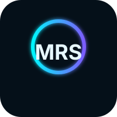

  

# Hi 👋, I'm Marugani Reddi Sekhar 
<h3 align="left">🚀 Full Stack Developer | Data Science & AI Enthusiast</h3>

  

---

## 💫 About Me
🔭 Building **scalable web apps, backend systems & AI-driven solutions**  
🌱 Exploring **Machine Learning, LLMs & System Design**  
👯 Open to collaborate on **Full Stack & Open Source Projects**  
🤔 Focused on **Backend Engineering + Data Pipelines**  
💬 Ask me about **React, Node.js, APIs, Python, Databases**  
⚡ Fun fact: *I turn complex ideas into working products*  

---

## 🌐 Portfolio
🚀 Check out my work:  
👉 **[My Portfolio](https://myportfolio.sekhar.tech/)**  

---

## 🧠 Tech Stack

### 🚀 Full Stack Development

### ⚙️ Backend & Databases

### 📊 Data Science, ML & LLMs

 

### ☁️ DevOps & Tools

---

## 🚀 Featured Projects

- 🚗 **ParkPlaze** – Smart parking platform with booking, services & optimized slot allocation  
- 🛠️ **Meeseva Services Portal** – Azure-based full-stack service platform with secure APIs  
- 📄 **GitHub Documentation Generator** – Automated Python tool for structured repo documentation  
- ⚙️ **Compressor Toolkit** – Media & document compression system with optimized algorithms  

---

## 📄 Publications

📌 **Minimizing Return Rates in Online Fashion through Personalized Avatar-Based Fitting**  
→ IEEE SCIS 2025 (Accepted)  
🔗 [View Paper](https://link.springer.com/chapter/10.1007/978-3-032-22914-4_2)

📌 **Speech Emotion Recognition using Hybrid CNN–BiLSTM with Attention Mechanism**  
→ IEEE IATMSI 2026 (Accepted)  
🔗 [View Paper](https://ieeexplore.ieee.org/document/11466131)

---

# 📊 GitHub Stats:
 
 

---

## 🏆 Achievements & Badges

  

  
  
  
  

---

## 🌐 Connect With Me

  
  
  
  

---

## ✨ Dev Quote

  

---

## 👀 Visitors

  

---

⭐ *If you like my work, consider starring my repositories!*